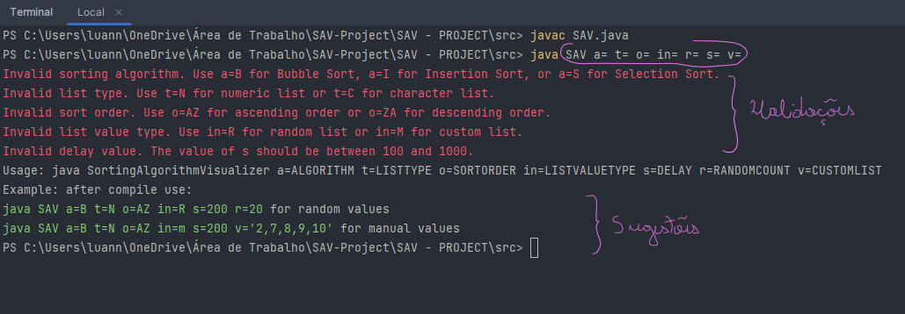
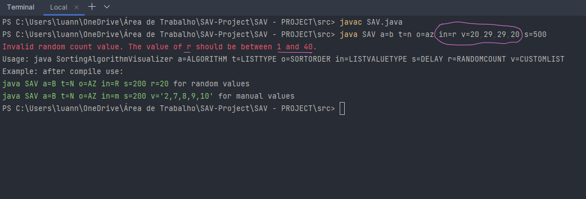
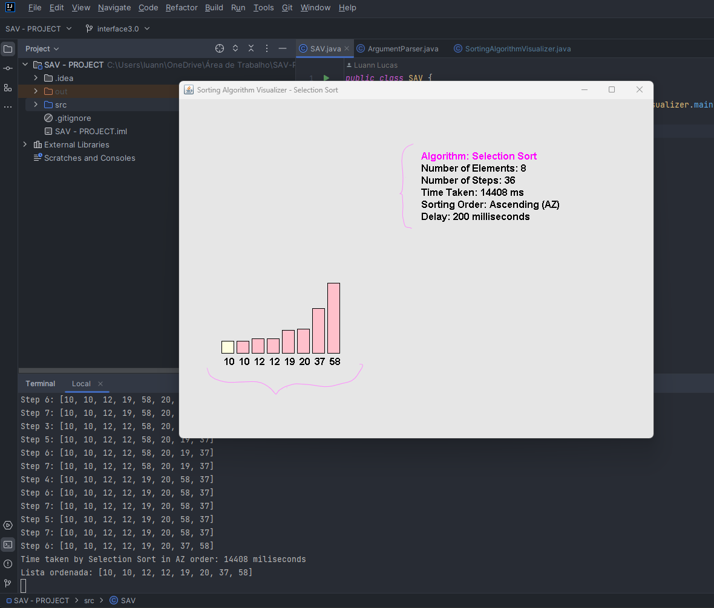

# Sorting Algorithm Visualizer - SAV 
<p> Estrutura de dados é um conceito fundamental em ciência da computação. Ela é o estudo de como organizar dados de forma eficiente e eficaz, de modo a permitir que sejam facilmente acessados, manipulados e armazenados.

***
O projeto é um visualizador de algoritmos de ordenação implementado em Java que permite o usuário especificar o algoritmo de ordenação, o tipo de lista, a ordem de ordenação, o tipo de valores da lista, o atraso entre os passos e outros parâmetros através de argumentos de linha de comando. implementei uma interface gráfica usando Java Swing para exibir a lista antes, durante e depois da ordenação, bem como as estatísticas da ordenação, como o tempo de execução e o número de passos realizados.
O programa atualmente suporta três algoritmos de ordenação: 
1. `Bubble Sort`:

```
O Bubble Sort é um algoritmo de ordenação simples e intuitivo.
Ele percorre repetidamente a lista, comparando pares de elementos adjacentes e trocando-os se estiverem na ordem errada.
O processo é repetido até que a lista esteja completamente ordenada, ou seja, não haja mais trocas a serem feitas.
O nome "Bubble Sort" vem do fato de que os elementos maiores "borbulham" para o final da lista durante as iterações.
O Bubble Sort tem uma complexidade de tempo médio e pior caso de O(n^2), onde n é o número de elementos na lista.
```
2. `Insertion Sort`:
```
O Insertion Sort é um algoritmo de ordenação simples e eficiente para listas pequenas ou quase ordenadas. Ele funciona da seguinte maneira:
O algoritmo começa percorrendo a lista a partir do segundo elemento.
Para cada elemento, o algoritmo o compara com os elementos anteriores.
Se o elemento atual for menor do que o elemento anterior, o algoritmo move o elemento anterior uma posição para a direita.
O algoritmo continua comparando o elemento atual com os elementos anteriores e movendo-os para a direita até encontrar a posição correta para inserir o elemento atual.
O processo é repetido para todos os elementos da lista, resultando em uma lista ordenada.
```
3. `Selection Sort`:
```
O Selection Sort é outro algoritmo de ordenação simples, porém um pouco mais eficiente que o Bubble Sort.
Ele divide a lista em duas partes: uma parte ordenada e uma parte não ordenada.
A cada iteração, o algoritmo encontra o menor (ou maior, dependendo da ordem desejada) elemento na parte não ordenada e o coloca na posição correta na parte ordenada.
O processo é repetido até que a lista esteja completamente ordenada.
O Selection Sort também tem uma complexidade de tempo médio e pior caso de O(n^2).
```

Em resumo, os três algoritmos têm complexidade de tempo e eficiência semelhantes, com uma complexidade quadrática. No entanto, o Insertion Sort é um pouco mais eficiente do que o Bubble Sort e o Selection Sort em listas pequenas ou quase ordenadas. Além disso, o Insertion Sort é estável, enquanto o Selection Sort não é. No entanto, para listas grandes, todos os três algoritmos são ineficientes e podem ser substituídos por algoritmos de ordenação mais eficientes, como o Merge Sort ou o Quick Sort.

***
### Parâmetros:

- O usuário pode escolher o algoritmo desejado através do argumento "a" seguido do código correspondente ao algoritmo.
- O tipo de lista pode ser numérico (N) ou de caracteres (C), mas apenas o tipo numérico está implementado no momento.
- A ordem de ordenação pode ser ascendente (AZ) ou descendente (ZA). O usuário pode especificar a ordem desejada através do argumento "o".
- O tipo de valores da lista pode ser aleatório (R) ou personalizado (M). No caso de valores aleatórios, o usuário pode especificar a quantidade de valores através do argumento "r". No caso de valores personalizados, o usuário deve fornecer os valores separados por vírgula através do argumento "v".
- O atraso entre os passos da ordenação pode ser especificado em milissegundos através do argumento "s".

### Diagrama de classes:
O projeto é composto por várias classes e interfaces que implementam a lógica de ordenação, a interface gráfica e a manipulação dos argumentos de linha de comando. Cada classe e interface possui responsabilidades específicas e trabalham em conjunto para fornecer a funcionalidade completa do programa.
***


***

#### Classe ArgumentParser:
Responsável por analisar e validar os argumentos de linha de comando passados para o programa.
- Possui um mapa de argumentos (argsMap) que armazena os argumentos e seus valores correspondentes.
- Possui uma lista de erros (errors) que armazena mensagens de erro encontradas durante a validação dos argumentos.
- O método parseArgs analisa os argumentos passados e preenche o mapa de argumentos.
- O método validateArguments verifica se os argumentos são válidos de acordo com as regras definidas.
- Os métodos `getString`, `getInt` e `getIntArray` são utilizados para obter os valores dos argumentos.
- Os métodos `isValidSortOrder`, `isValidListValueType`, `isValidAlgorithm`, `isValidListType`, `getListTypeMessage`, `isValidRandomCount` e `isValidDelay` são utilizados para validar os valores dos argumentos.
- O método `addError` adiciona uma mensagem de erro à lista de erros.
- O método `getErrors` retorna a lista de erros encontrados durante a validação dos argumentos.

#### Interface SortAlgorithm:
Define os métodos que devem ser implementados por uma classe que representa um algoritmo de ordenação.
- O método `sort` realiza a ordenação de um array.
- O método `getSortingTime` retorna o tempo de ordenação.
- O método `getStepCounter` retorna o número de passos realizados.
- O método `getName` retorna o nome do algoritmo de ordenação.
- O método `logStep` registra um passo da ordenação.


#### Classe BubbleSort:
- Implementa a interface `SortAlgorithm`.
- Responsável por realizar a ordenação de um array utilizando o algoritmo Bubble Sort.
- Possui as variáveis sortingTime e stepCounter para armazenar o tempo de ordenação e o número de passos realizados, respectivamente.
- O método `sort` realiza a ordenação do array utilizando o algoritmo Bubble Sort.
- O método `getSortingTime` retorna o tempo de ordenação.
- O método `getStepCounter` retorna o número de passos realizados.
- O método `getName` retorna o nome do algoritmo de ordenação.

#### Classe InsertionSort:
- Implementa a interface `SortAlgorithm`.
- Responsável por realizar a ordenação de um array utilizando o algoritmo Insertion Sort.
- Possui as variáveis sortingTime e stepCounter para armazenar o tempo de ordenação e o número de passos realizados, respectivamente.
- O método `sort` realiza a ordenação do array utilizando o algoritmo Insertion Sort.
- O método `getSortingTime` retorna o tempo de ordenação.
- O método `getStepCounter` retorna o número de passos realizados.
- O método `getName` retorna o nome do algoritmo de ordenação.

#### Classe SelectionSort:
- Implementa a interface `SortAlgorithm`.
- Responsável por realizar a ordenação de um array utilizando o algoritmo Selection Sort.
- Possui as variáveis sortingTime e stepCounter para armazenar o tempo de ordenação e o número de passos realizados, respectivamente.
- O método `sort` realiza a ordenação do array utilizando o algoritmo Insertion Sort.
- O método `getSortingTime` retorna o tempo de ordenação.
- O método `getStepCounter` retorna o número de passos realizados.
- O método `getName` retorna o nome do algoritmo de ordenação.

#### Classe RandomList:
Responsável por gerar um array de números inteiros aleatórios.
- O método `generateRandomList` gera um array de números inteiros aleatórios com base no tamanho especificado.
- O método `getRandomList` retorna esse array.

#### Classe SortAlgorithmFactory:
Responsável por criar instâncias de classes que implementam a interface `SortAlgorithm` com base em um algoritmo especificado.
- O método `createSorter` recebe o nome do algoritmo e retorna uma instância da classe correspondente.

#### Classe SortingAlgorithmVisualizer:
Responsável por interpretar os argumentos de linha de comando, validar os argumentos, gerar ou obter o array de números inteiros, realizar a ordenação e visualizar o - processo de ordenação.
- O método `main` é o ponto de entrada do programa.
- O método `sortAndVisualize` realiza a ordenação e visualização do array utilizando o algoritmo especificado.
- A classe interna `StepCallback` implementa a interface `SortStepCallback` e é utilizada para atualizar a visualização a cada passo da ordenação.

### Interface SortStepCallback:
- Define o método onStep que é chamado a cada passo da ordenação para atualizar a visualização.

#### Classe SavGUI:
Classe responsável por exibir a interface gráfica do programa.
- Estende a classe JPanel do Swing.
- Possui variáveis para armazenar o array a ser ordenado, o array original, o número de passos, o algoritmo de ordenação, a ordem de ordenação e o atraso entre os passos.
- Sobrescreve o método paintComponent para desenhar os elementos gráficos na tela.
- Possui métodos auxiliares para desenhar as barras do gráfico, os números do array e as estatísticas da ordenação.

### Classe SAV:
reponsavel pela chamada do main

***

### Validação de Parâmetros:

**!!! Passarei os valores errados para fins de demontração das tratativas**





- a= O algoritmo de ordenação a ser usado. Os valores possíveis são `b para o BubbleSort, i para o InsertionSort, s para SelectionSort`


- t= O tipo de lista. Os valores possíveis são `n` para uma lista de números, `c` para uma lista de caracteres.


- o= A ordem de classificação. Os valores possíveis são `az` para ordem crescente, `za` para ordem decrescente.


- in= Se os valores devem ser aleatórios ou informados pelo usuário. Os valores possíveis são `r` para aleatório, `m` para informado pelo usuário.


- v= Os valores da lista. Se forem informados pelo usuário ou seja `in=m`. Os valores devem ser separados por vírgulas e r nao precisa ser passado.


- r= numero de elementos. Se `in=r` entao deve-se parametizar `r` para quantidade de elementos e `v` nao precisa ser passado.



- s= A pausa a cada iteração, em milissegundos. `possiveis de 100-1000`


### Exemplos de comandos **corretos**:

**!!! Lembre-se de compilar** 

```
javac SAV.java
```

```
java SAV a=s t=N o=AZ in=m s=200 v='12,37,58,19,10,20,12,10'
```

Ordenará uma lista de 8 números que foram passados em `v` de menor para maior, usando o BubbleSort. O programa fará uma pausa de 200 milissegundos a cada iteração.


```
java SAV a=s t=n o=az in=r r=40 s=200
```

Ordenará uma lista de 40 números aleatórios de menor para maior, usando o SelectionSort. O programa fará uma pausa de 200 milissegundos a cada iteração.



***

<div class="profile-link">
  <a href="https://gitlab.com/hey_luannlucas" style="display: flex; align-items: center; text-decoration: none;">
    
    <span class="name" style="font-size: 24px; font-weight: bold; color: #0000f;">Luann Lucas</span>
  </a>
</div>


