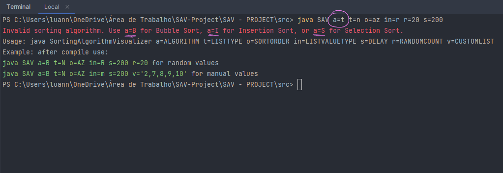

# Sorting Algorithm Visualizer - SAV 
<p> Estrutura de dados é um conceito fundamental em ciência da computação. Ela é o estudo de como organizar dados de forma eficiente e eficaz, de modo a permitir que sejam facilmente acessados, manipulados e armazenados. Aqui demontraremos a organizacao com o Bubble Sort, Insetion Sort e Selection Sort.

## Algoritmos de ordenacao:
- **Bubble sort:** um algoritmo de ordenação simples que funciona comparando pares de adjacentes em um array e trocando-os se eles estiverem fora de ordem. O algoritmo começa no início do array e compara os dois primeiros elementos. Se eles estiverem fora de ordem, o algoritmo troca os elementos de posição. O algoritmo então continua para o próximo par de elementos e repete o processo. O algoritmo continua até chegar ao final do array.
O bubble sort é um algoritmo eficiente para arrays pequenos, mas pode ser muito lento para arrays grandes. O motivo é que o algoritmo compara pares de adjacentes em cada iteração, mesmo que os elementos já estejam ordenados.

- **Insertion sort:** é um algoritmo de ordenação que funciona comparando cada elemento em um array com os elementos anteriores e movendo-o para a posição correta se estiver fora de ordem. O algoritmo começa no segundo elemento do array e compara-o com o primeiro elemento. Se o segundo elemento for menor que o primeiro elemento, o algoritmo move o segundo elemento para a posição do primeiro elemento. O algoritmo então continua para o próximo elemento e repete o processo. O algoritmo continua até chegar ao final do array.
O insertion sort é um algoritmo eficiente para arrays pequenos e médios. O motivo é que o algoritmo só compara cada elemento com os elementos anteriores, o que significa que não precisa comparar pares de adjacentes em cada iteração.

- **Selection sort:** é um algoritmo de ordenação que funciona encontrando o menor elemento em um array e movendo-o para a primeira posição, repetindo o processo para os elementos restantes. O algoritmo começa no início do array e encontra o menor elemento. O algoritmo então move o menor elemento para a primeira posição e remove-o do array. O algoritmo então continua para o próximo elemento e repete o processo. O algoritmo continua até chegar ao final do array.
O selection sort é um algoritmo eficiente para arrays grandes. O motivo é que o algoritmo só precisa encontrar o menor elemento em cada iteração, o que é muito mais rápido do que comparar pares de adjacentes ou comparar cada elemento com os elementos anteriores.

***
### Diagrama de classes:


***

### Parametros requeridos:

**!!! Passarei os valores errados para fins de demontração das tratativas**


- a= O algoritmo de ordenação a ser usado. Os valores possíveis são `b para o BubbleSort, i para o InsertionSort, s para SelectionSort`



- t= O tipo de lista. Os valores possíveis são `n` para uma lista de números, `c` para uma lista de caracteres.


- o= A ordem de classificação. Os valores possíveis são `az` para ordem crescente, `za` para ordem decrescente.


- in= Se os valores devem ser aleatórios ou informados pelo usuário. Os valores possíveis são `r` para aleatório, `m` para informado pelo usuário.


- v= Os valores da lista. Se forem informados pelo usuário ou seja `in=m`. Os valores devem ser separados por vírgulas e r nao precisa ser passado.


- r= numero de elementos. Se `in=r` entao deve-se parametizar `r` para quantidade de elementos e `v` nao precisa ser passado.


- s= A pausa a cada iteração, em milissegundos. `possiveis de 100-1000`


### Exemplos de comandos **corretos**:

**!!! Lembre-se de compilar** 

```
javac SAV.java
```

```
java SAV a=b t=n o=az in=m v=0,1,2,3,4,5,6,7,8,9 s=100 
```

Ordenará uma lista de 10 números que foram passados em `V` de menor para maior, usando o BubbleSort. O programa fará uma pausa de 100 milissegundos a cada iteração.


```
java SAV a=i t=n o=az in=r r=40 s=140
```

Ordenará uma lista de 40 números aleatórios de menor para maior, usando o InsertionSort. O programa fará uma pausa de 140 milissegundos a cada iteração.


